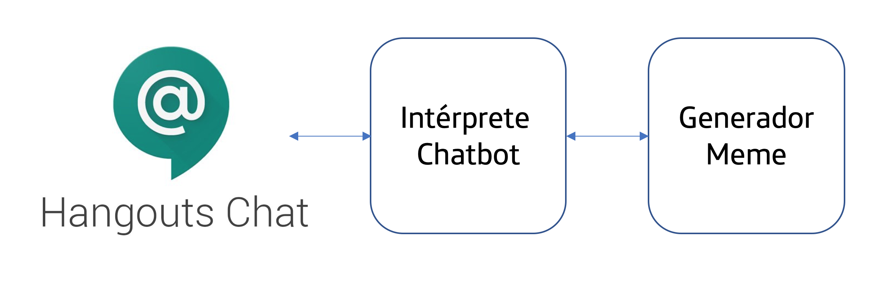

# Chatbot

Es un simple chatbot integrado conGoogle Hangouts Chat, escrito en Elixir, usando Phoenix framework. Esta aplicación está lista para empaquetar gracias a la inclusión del Dockerfile y preparada para ejecutar en un entorno serverless con Knative. 

Esta aplicación se realizó para una demo en Cloud Next '19, y se convierte para su uso en el Google Summit de Madrid 2019.

# Dependencies

El chatbot recibie los mensajes de 
[Google Hangouts Chat](https://developers.google.com/hangouts/chat/).

Hay una dependencia en [Cloud Firestore](https://cloud.google.com/firestore/)
en *Datastore Mode*.

El chatbot utiliza un servicio de generación de memes que está publicado en https://meme-roygwptruq-uc.a.run.app/

# Compilar

1. Generate a new secret key base.

```shell
 SECRET_KEY_BASE=$(elixir -e ":crypto.strong_rand_bytes(48) |> Base.encode64 |> IO.puts")
 sed "s|SECRET+KEY+BASE|$SECRET_KEY_BASE|" config/prod.secret.exs.sample >config/prod.secret.exs
 ```

1. To build with Google [Cloud Build](https://cloud.google.com/cloud-build/),
simply issue this [gcloud](https://cloud.google.com/sdk/gcloud/) command.

```
gcloud builds submit --tag=gcr.io/<GOOGLE CLOUD PROJECT>/chatbot:v1 .
```

# Deploy

These instructions are for deploying the meme-bot to Google's Cloud Run Service.

1. Enable __Google Cloud Firestore__ and create a database in __Datastore__ mode
(use a geography based on where you will deploy the chatbot).

1. Give your _default compute service account_ datatore read and write permissions

1. Deploy the built image to __Cloud Run__

You'll need to set a couple of environment variables.

* PROJECT = Your Google Cloud Project Name. This is required to connect to datastore.
* MEME = a URL for a MEME generation service. You can use the one in the example below.

```shell
 gcloud beta run deploy chatbot --image gcr.io/<GOOGLE CLOUD PROJECT>/chatbot:v1 --memory=512M --set-env-vars=PROJECT=<PROJECT NAME>,MEME=https://meme-roygwptruq-uc.a.run.app/
 ```

 1. Register the chatbot with __Hangouts Chat__ in your __GSuite__ domain.

 This is done by creating a domain scoped project. Select synchronous / HTTP for
 the bot configuration and set the URL to be the deployed URL of your Cloud Run
 service, plus the path /api/hello

 ```
 https://<your service>.a.run.app/api/hello
 ```
 
